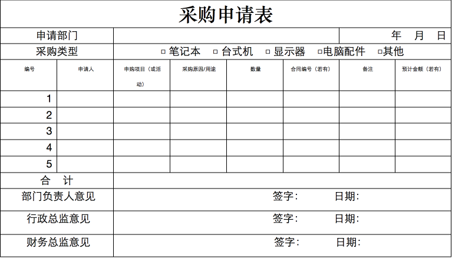
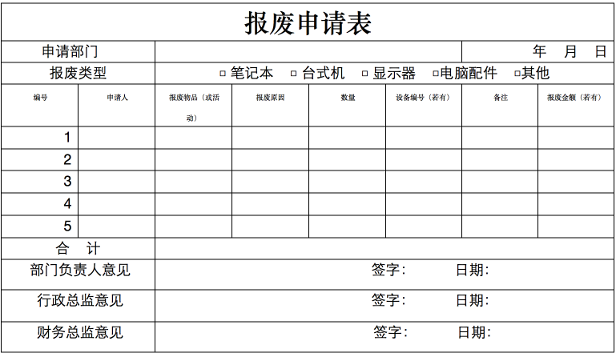

#公司电脑设备资产管理制度
  
##第一章  总则 
 
####第一节     为了加强公司电脑设备统一管理，安全运行，并使电脑资产明晰，责任明确。特制定以下管理制度。 
####第二节     凡涉及使用属公司资产的电脑设备均适用于本制度。 
 
##第二章  购买申请 
  
####第三节     新购电脑设备，由申购部门填写《采购申请表》进行申请购买。 
####第四节     在《采购申请表》上，根据《电脑资产配件规范》选择提供购买设备类型的需求，由部门负责人、行政总监、财务总监进行审批，最后由运维部审核已有电脑设备情况决定是否进行新购或进行调配。 
 
##第三章  设备采购（附表1） 
  
####第五节     《采购申请表》全部审批通过后，交由运维部统一进行电脑设备的采购。 
####第六节     电脑设备采购到货后，登记、录入电脑资产管理信息系统，并粘贴公司统一编号进行标识，设备驱动及保修卡统一进行存放。 
####第七节     运维部根据购买发票进入报销结款流程，并建立相应的电脑设备资产档案。 
####第八节     申购部门同事到运维部进行设备收货登记，确定电脑设备的责任人，并领取电脑设备实物。 
####第九节     确定责任人后，运维部把电脑设备信息更新到电脑资产管理相关系统。 
 
##第四章  设备管理 
 
####第十节     电脑设备由运维部统一进行管理、维护，各部门负责人对本部门电脑设备有监管职责。 
####第十一节  为了优化电脑设备资源配置，充分整合电脑设备资源利用，运维部有权对公司电脑进行合理调配。 
####第十二节  电脑设备由运维部统一进行编号标识，其它人员未经授权不得私自对编号进行涂改或更换。 
####第十三节  公司所购电脑设备，个人不得私自对设备硬件配件进行拆除、更改、替换等非法操作，如发现以上操作者，上报行政部给予严惩。 
 
##第五章  设备使用 
  
####第十四节  公司实行电脑设备使用人责任制：“谁使用，谁负责；恶意损坏，按价赔偿”。 
####第十五节  公司电脑设备禁止用于一切与公司工作无关的活动。 
####第十六节  公司电脑设备只得用于在公司内部使用，未经允许不得将公司电脑设备带离公司正常工作范围。如果因工作需要要外带的，需由行政部审批同意。重大或特殊设备还需财务部审批同意后方可外带。 
 
##第六章  设备维修 
 
####第十七节  公司电脑设备在正常使用过程中出现故障的，及时报由运维部进行故障维修处理。 
####第十八节  人为因素造成电脑设备故障或损坏的，由责任人负责对电脑设备进行维修至正常使用。彻底损坏的，根据使用时间和财务折旧率确定设备价值金额，进行赔偿。 
####第十九节  公司电脑设备未经允许私自维修或私自外出维修，造成的一切后果及费用由当事人承担。 
 
##第七章  设备报废（附表2） 
  
####第二十节   电脑设备多次无法维修或维修费用已超出当前设备价值，为确保用户的数据安全，可建议进行设备报废处理。 
####第二十一节  电脑设备在使用过程中，不能满足工作使用需求，运行缓慢，严重影响工作进度，可建议进行设备报废处理。
####第二十二节  电脑设备使用超过公司制定的设备使用年限，为确保设备安全使用，可建议进行设备报废处理。
####第二十三节  公司电脑设备需要进行报废的，须由运维部填写电脑报废申请，经行政部审核，财务部审批后进行报废。
####第二十四节  已完成审批的报废设备，运维部应及时更新对应的固定资产管理信息。
####第二十五节  运维部对通过报废审批的电脑设备回收，作为废旧产品卖给计算机回收商，行政部负责监督实施，最后将明细报财务部做相关账目处理。
 
##第八章  附则 
 
第二十六节   本制度属于公司内部管理制度，希望认真遵守，并严禁外泄。 
####第二十七节   本制度于2013年6月1日正式开始实施。 

###设备采购（附表1）   
  

###设备报废（附表2） 

